# Viikko 1

### Kysymys 1
Vastaus: 5

### Kysymys 2
Vastaus: 5

### Kysymys 3
Vastaus: ident

### Kysymys 4
Vastaus: varchar

### Kysymys 5
Vastaus: iso_country

### Kysymys 6
Vastaus: country

### Kysymys 7
Vastaus: iso_country

### Kysymys 8
Vastaus: varchar

# Viikko 2

## Yhteen tauluun kohdistuvien kyselyiden harjoitukset

### Kysymys 1
select * from goal
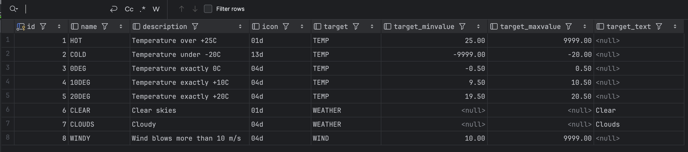

### Kysymys 2
kesken

### Kysymys 3
select name from airport where iso_country ="FI" order by name ASC;
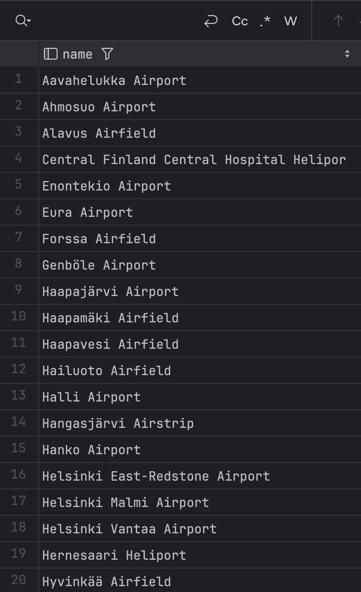

### Kysymys 4
select name, type from airport where iso_country ="FI" order by type, name;

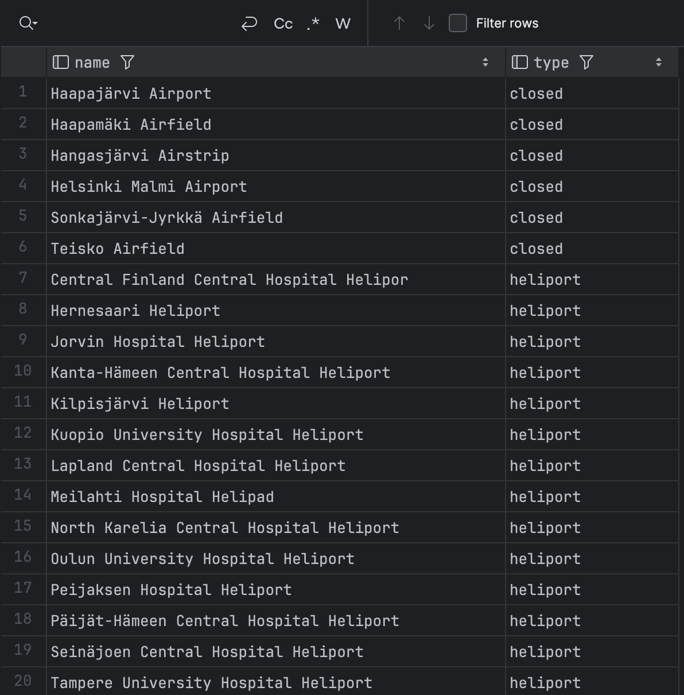

### Kysymys 5
select name from country where name like "F%";

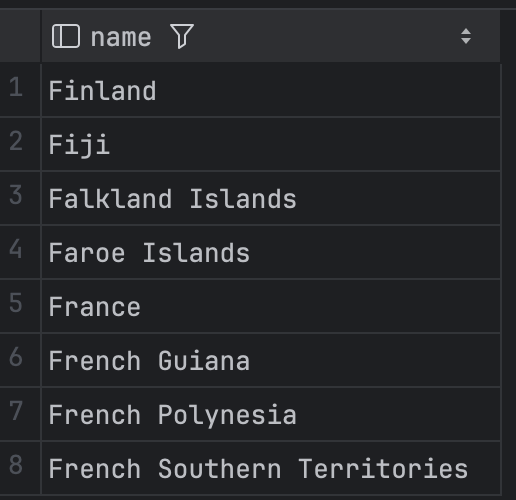

### Kysymys 6
select name from country where name like "%F%";

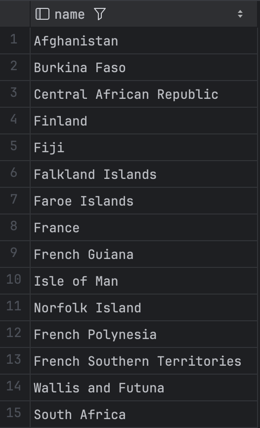

### Kysymys 7
select location from game where id = 2;

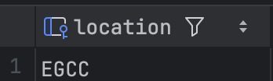

### Kysymys 8
select co2_consumed from game where id = 3;

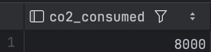

### Kysymys 9
select co2_budget from game where id = 1;

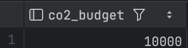

## Where-osan liitosehto harjoitukset

### Kysymys 1
select country.name AS "country name",
airport.name AS "airport name" from airport,
country where airport.iso_country = country.iso_country and airport.iso_country = "IS";

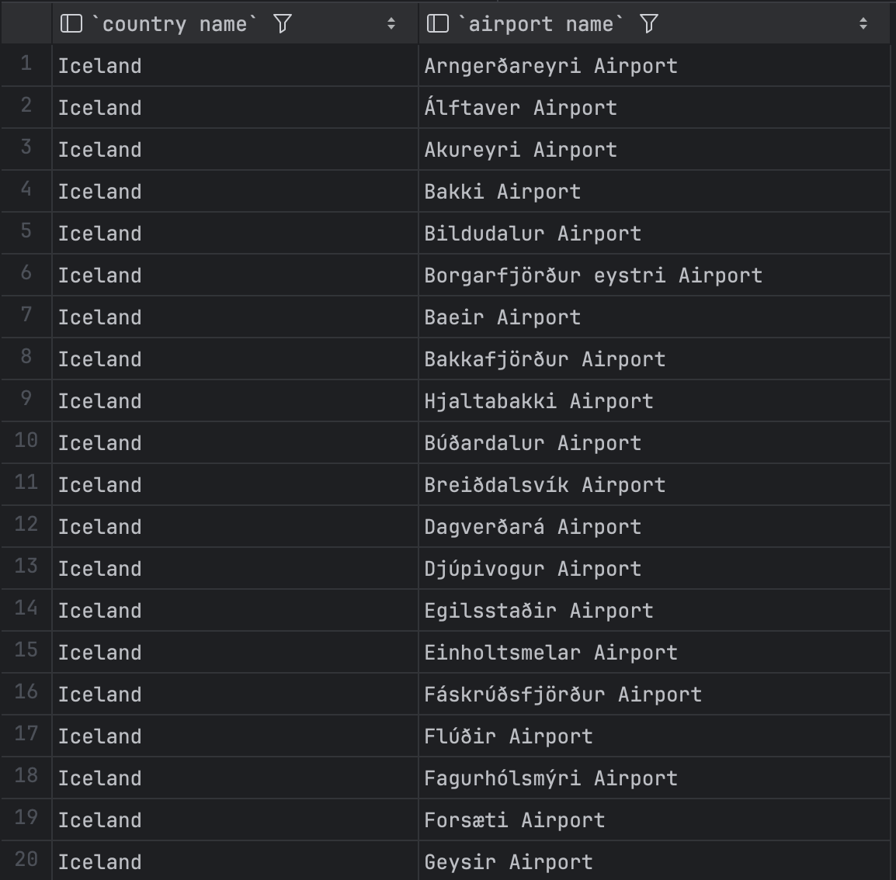

### Kysymys 2
select airport.name as "airport name" from airport where iso_country = "FR" and type = "large_airport"

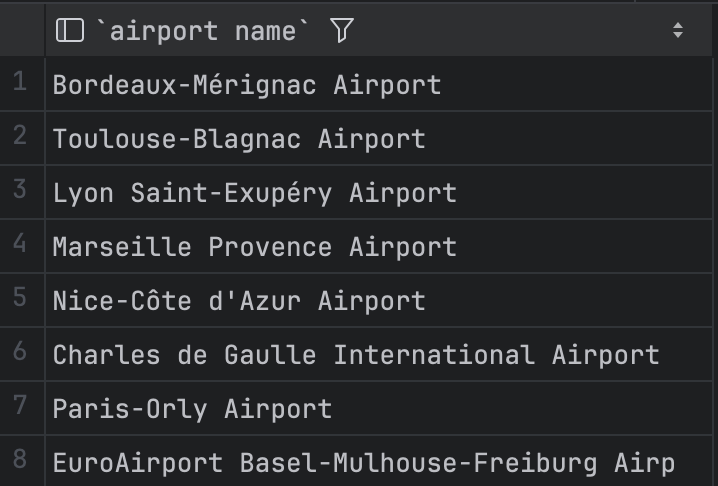

### Kysymys 3
select country.name as "country_name",
airport.name as "airport_name" from country,
airport where country.iso_country = airport.iso_country and country.continent = "AN"

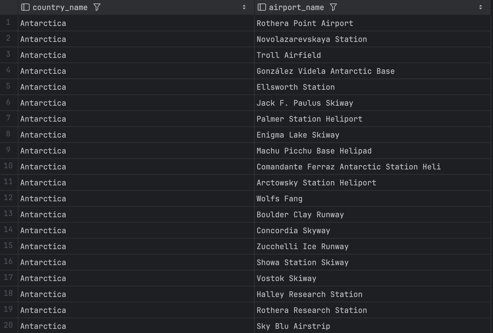

### Kysymys 4
select airport.elevation_ft from airport,
game where game.location = airport.ident and game.screen_name = "Heini"

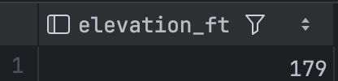

### Kysymys 5
select airport.elevation_ft * 0.3048 as "elevation_m"  from airport,
game where game.location = airport.ident and game.screen_name = "Heini"

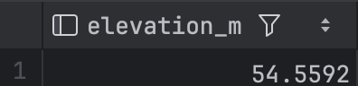

### Kysymys 6
select airport.name from airport, game where game.location = airport.ident and screen_name = "Ilkka"

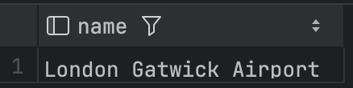

### Kysymys 7
select country.name from country, airport,
game where game.location = airport.ident and airport.iso_country = country.iso_country
and screen_name = "Ilkka"

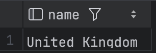

### Kysymys 8
kesken

### Kysymys 9
kesken

### Kysymys 10
kesken

